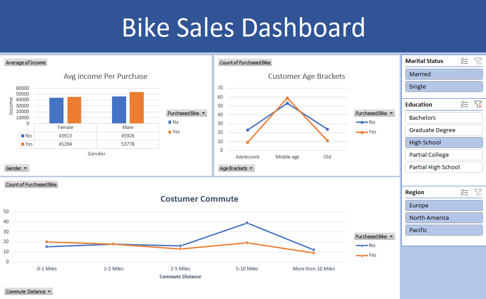

# Bike Sales Performance – Interaktív Excel Dashboard & Adattisztítás

Ebben a portfólió projektben egy kerékpár-értékesítési adatbázis teljes körű adatfeldolgozását, tisztítását és interaktív vizualizációját valósítottam meg **Microsoft Excel** segítségével. A célom a vásárlói szokások, a demográfiai jellemzők, valamint a vásárlást befolyásoló kulcstényezők (jövedelem, ingázási távolság, életkor) feltárása volt.

---

## 📊 Dashboard Áttekintés



A létrehozott vezérlőpult lehetővé teszi az értékesítési és demográfiai trendek dinamikus szűrését családi állapot, iskolai végzettség és földrajzi régió szerint.

---

## 🛠️ Adatelőkészítés és Adattisztítás (Data Cleaning)

A projekt a nyers adatokat tartalmazó munkalapból indult ki. Az adatok nem voltak közvetlenül alkalmasak megbízható üzleti kimutatások készítésére, ezért a következő tisztítási és strukturálási lépéseket hajtottam végre a tisztított munkalapon:

### 1. Duplikációk eltávolítása (Remove Duplicates)
* A nyers adathalmazban több rekord is duplikálva szerepelt (azonos vásárlói azonosítók és adatok).
* Az Excel beépített duplikátumszűrőjével eltávolítottam a redundáns sorokat, így minden vásárló pontosan egyszer szerepel a modellben.

### 2. Rövidítések feloldása és mezők egységesítése (Find & Replace / Standardizálás)
* **Marital Status (Családi állapot):** Az eredeti táblázatban csupán `M` és `S` kódok szerepeltek. Ezeket átírtam egyértelmű, könnyen olvasható értékekre:  
  * `M` $\rightarrow$ **Married**  
  * `S` $\rightarrow$ **Single**
* **Gender (Nem):** Az eredeti `M` és `F` jelöléseket kibontottam **Male** és **Female** értékekre. Ez nemcsak a félreértéseket küszöböli ki (a családi állapot `M` betűjével szemben), hanem a kimutatások és diagramok feliratain is közvetlenül használhatóvá teszi az adatokat.

### 3. Új származtatott oszlop létrehozása logikai függvénnyel (`Age Brackets`)
A nyers életkor (`Age`) folytonos numerikus értékként nehezen volt értelmezhető vonaldiagramon. Ezért egy beágyazott `IF` függvénnyel létrehoztam egy új **Age Brackets** (Korcsoport) kategorikus mezőt:

```excel
=IF(L2>54; "Old"; IF(L2>=31; "Middle age"; IF(L2<31; "Adolescent"; "Invalid")))
```

Ez lehetővé tette a vásárlók három jól elkülönülő generációs csoportba való besorolását:
* **Adolescent** (< 31 év)
* **Middle age** (31–54 év)
* **Old** (55+ év)

### 4. Kategóriák sorrendezése (Custom Sorting)
* A napi ingázási távolság (`Commute Distance`) kategóriáit (`0-1 Miles`, `1-2 Miles`, `2-5 Miles`, `5-10 Miles`, `More than 10 Miles`) logikai, növekvő sorrendbe rendeztem a pivot táblákban, hogy a vonaldiagramok valós trendet mutassanak.

---

## 📈 Kimutatások és Vizualizációk (Pivot Tables & Charts)

A tiszta adatokból különálló **Pivot Table**-öket generáltam, amelyekhez dedikált diagramokat kapcsoltam:

1. **Avg Income Per Purchase (Oszlopdiagram):**
   * A vásárlók és nem vásárlók átlagjövedelmét hasonlítja össze nemek szerinti bontásban.
   * **Megállapítás:** A kerékpárt vásárló férfiak és nők átlagjövedelme egyaránt magasabb, mint a nem vásárlóké; a legnagyobb vásárlóerőt a magasabb jövedelmű férfiak képviselik (átlagosan 53 778 USD).

2. **Customer Age Brackets (Vonaldiagram):**
   * Az életkori csoportok szerinti vásárlási arányokat vizsgálja.
   * **Megállapítás:** A legnagyobb vásárlói bázist a középkorúak (**Middle age**) adják mind abszolút számban, mind konverziós arányban. A fiatalabbak és az idősebbek körében jelentősen alacsonyabb a vásárlási hajlandóság.

3. **Customer Commute (Vonaldiagram):**
   * Az ingázási távolság és a kerékpárvásárlás kapcsolatát ábrázolja.
   * **Megállapítás:** A kerékpárt vásárlók legnagyobb része a rövid távon (különösen a **0–1 mérföld** között) ingázók közül kerül ki. A távolság növekedésével (különösen 5 mérföld felett) drasztikusan lecsökken a vásárlási kedv.

---

## 🎛️ Interaktív Szeletelők (Slicers)

A dashboard jobb oldalán három dinamikus szeletelőt helyeztem el, amelyeket összekapcsoltam az összes Pivot diagrammal:
* **Marital Status** (*Married*, *Single*)
* **Education** (*Bachelors*, *Graduate Degree*, *High School*, *Partial College*, *Partial High School*)
* **Region** (*Europe*, *North America*, *Pacific*)

Ezek segítségével a felhasználó egyetlen kattintással szűrheti az egész riportot specifikus vásárlói szegmensekre.

---

## 💡 Főbb Üzleti Következtetések

* **Ideális célközönség:** 31–54 év közötti, átlag feletti jövedelemmel rendelkező felnőttek, akik viszonylag közel (0–2 mérföldre) laknak a munkahelyüktől.
* **Marketing fókusz:** A marketingkampányokat érdemes a rövid távon ingázó, városi környezetben élő középkorú munkavállalókra optimalizálni, prémium termékkínálattal.

---

## 📁 Fájlok a repository-ban

* `Bike_Sales_Project.xlsx` – A teljes munkafüzet a nyers adatokkal, a tisztított táblával, a pivot kalkulációkkal és a kész dashboarddal.
* `Bike_Sales_Dashboard.png` – A működő Excel dashboard nézete.